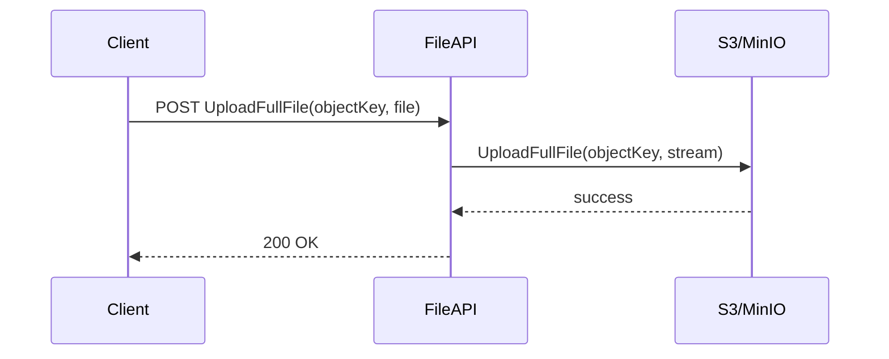
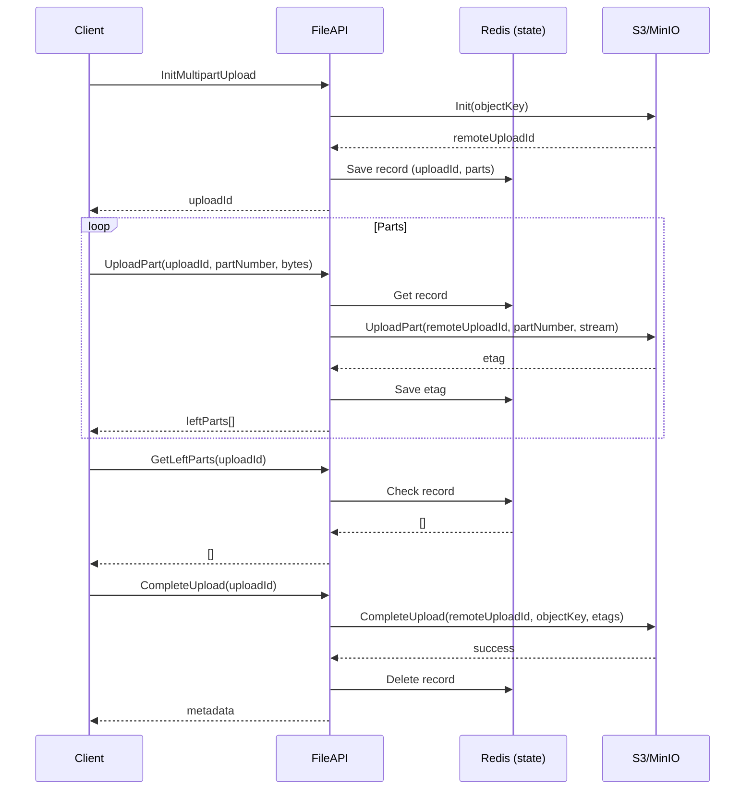
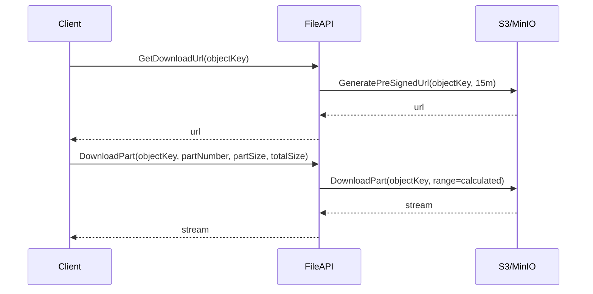

# 📦 FileAPI (.NET 9)

A lightweight **file upload & download API** built on **.NET 9**, supporting both:

- ✅ **Single full-file uploads** (up to configured limit).  
- ✅ **Multipart uploads** for large files (resumable, parallel, reliable).  
- ✅ **Pre-signed download URLs** and partial streaming downloads.  

Storage is backed by **AWS S3** or **S3-compatible services** (like MinIO).  
Upload session state is tracked in **Redis**.

---

## ⚙️ Environment Variables

These must be configured before running the API.

| Variable | Required | Format/Example | Description |
|----------|----------|----------------|-------------|
| `ASPNETCORE_ENVIRONMENT` | ✅ | `Development` / `Production` | Standard .NET env setting. |
| `REDIS_CONNECTION_STRING` | ✅ | `host:port,user=user,password=pass` | Redis connection for tracking uploads. |
| `AWS_ACCESS_KEY_ID` | ✅ | e.g. `XsQJMXI9VbcVK6uIF1u8` | S3/MinIO access key. |
| `AWS_SECRET_ACCESS_KEY` | ✅ | e.g. `6FLko5mHPRRtENFaNk539x0k9zqiFuUIY65bYobj` | S3/MinIO secret key. |
| `AWS_S3_BUCKET_NAME` | ✅ | `test-bucket` | Target bucket for uploads. |
| `AWS_S3_REGION_SYSTEM_NAME` | ❌ (if using `S3_SERVICE_URL`) | `us-west-1` | Region name (AWS). Ignored if `S3_SERVICE_URL` is set. |
| `S3_SERVICE_URL` | ❌ | `http://localhost:9000` | Service URL for MinIO or custom S3 endpoint. |
| `S3_FORCE_PATH_STYLE` | ❌ | `true` / `false` | Use path-style requests (needed for MinIO). |
| `MAX_ALLOWED_PART_SIZE_IN_BYTES` | ✅ | `104857600` (100 MB) | Maximum allowed upload chunk size. |
| `RECYCLABLE_STREAM_BLOCK_SIZE` | ❌ | `81920` | Block size for recyclable memory streams (default 80 KB). |
| `RECYCLABLE_STREAM_BLOCK_LARGE_BUFFER_MULTIPLE` | ❌ | `1048576` | Large buffer multiple (default 1 MB). |

### Validation
At startup, the API validates critical env vars using regex rules. If invalid, the app will throw and stop.

---

## 🚀 Endpoints

All endpoints are exposed under `/api/v1/`.  
An interactive **Scalar API Explorer** (Swagger/OpenAPI) is also available at:

```

http\://<host>:<port>/scalar

````

---

### 🔹 UploadController (`/api/v1/Upload`)

1. **Upload Full File**
```http
POST /api/v1/Upload/UploadFullFile?objectKey={key}
Content-Type: multipart/form-data
````

* Query: `objectKey` → file identifier.
* Form: `file` → file data.
* Limit: **50 MB**.
* Response: `200 OK`.

---

2. **Init Multipart Upload**

```http
POST /api/v1/Upload/InitMultipartUpload
Content-Type: application/json
```

Body:

```json
{
  "objectKey": "myvideo.mp4",
  "partCount": 10,
  "partSizeInBytes": 5242880,
  "metadata": { "owner": "demo" }
}
```

* Validates `partSizeInBytes` ≤ `MAX_ALLOWED_PART_SIZE_IN_BYTES`.
* Returns: `uploadId` (string).

---

3. **Upload Part**

```http
POST /api/v1/Upload/UploadPart?uploadId={id}&partNumber={n}
Content-Type: application/octet-stream
<raw chunk>
```

* Query: `uploadId` (from init), `partNumber` (1-based).
* Body: raw chunk bytes.
* Returns: `200 OK`.

---

4. **Get Left Parts**

```http
GET /api/v1/Upload/GetLeftParts?uploadId={id}
```

* Returns: list of missing part numbers.
  Example: `[2, 4]`.

---

5. **Complete Upload**

```http
POST /api/v1/Upload/CompleteUpload?uploadId={id}
```

* Finalizes upload.
* Returns: metadata provided in Init.

---

6. **Abort Upload**

```http
DELETE /api/v1/Upload/AbortUpload?uploadId={id}
```

* Deletes session and aborts remote upload.

---

### 🔹 DownloadController (`/api/v1/Download`)

1. **Get Download URL**

```http
GET /api/v1/Download/GetDownloadUrl?objectKey={key}
```

* Returns: pre-signed URL (15 min validity).

2. **Download Part**

```http
GET /api/v1/Download/DownloadPart?objectKey={key}&partNumber={n}&partSizeInBytes={size}&totalSizeInBytes={total}
```

* Returns: `application/octet-stream` with requested byte range.

---

### 🔹 UtilsController (`/api/v1/Utils`)

1. **Get File Size**

```http
GET /api/v1/Utils/GetFileSizeInBytes?objectKey={key}
```

* Returns: file size (bytes).

2. **Delete Files**

```http
DELETE /api/v1/Utils/DeleteFiles?objectKeys=file1&objectKeys=file2
```

* Deletes multiple files.
* Returns: list of deleted object keys.

---

## 🛠️ Flows & Diagrams

### Full File Upload



---

### Multipart Upload



---

### Download Flow



---

## 📚 Example Multipart Upload Flow

Here’s a full **client flow** for uploading a `15 MB` file with 5 MB chunks:

### 1. Init Upload

```bash
curl http://localhost:5102/api/v1/Upload/InitMultipartUpload \
  -H "Content-Type: application/json" \
  -d '{
    "objectKey": "bigfile.bin",
    "partCount": 3,
    "partSizeInBytes": 5242880,
    "metadata": { "project": "demo" }
  }'
```

Response:

```
"82d9e79f-4c1b-4b21-bf92-1e0e9a4937fa"
```

---

### 2. Upload All Parts

```bash
# Part 1
curl -X POST "http://localhost:5102/api/v1/Upload/UploadPart?uploadId=82d9e79f-...&partNumber=1" \
  -H "Content-Type: application/octet-stream" \
  --data-binary @chunk1.bin

# Part 2
curl -X POST "http://localhost:5102/api/v1/Upload/UploadPart?uploadId=82d9e79f-...&partNumber=2" \
  -H "Content-Type: application/octet-stream" \
  --data-binary @chunk2.bin

# Part 3
curl -X POST "http://localhost:5102/api/v1/Upload/UploadPart?uploadId=82d9e79f-...&partNumber=3" \
  -H "Content-Type: application/octet-stream" \
  --data-binary @chunk3.bin
```

---

### 3. Verify Left Parts

```bash
curl "http://localhost:5102/api/v1/Upload/GetLeftParts?uploadId=82d9e79f-..."
```

Response:

```
[]
```

---

### 4. Complete Upload

```bash
curl -X POST "http://localhost:5102/api/v1/Upload/CompleteUpload?uploadId=82d9e79f-..."
```

Response:

```json
{
  "metadata": { "project": "demo" }
}
```

---

## ✅ Summary

* **Small files** → use `/UploadFullFile` (limit 50 MB).
* **Large files** → use multipart flow (Init → UploadParts → GetLeftParts → Complete).
* **Downloads** → use `/Download/GetDownloadUrl` for direct access, or `/Download/DownloadPart` for partial streaming.
* **Redis** ensures session tracking.
* **S3/MinIO** handles actual storage.

---

## 🏗️ Tech Stack

* **.NET 9 (ASP.NET Core)**
* **Redis** (upload session tracking)
* **AWS S3 / MinIO** (object storage)
* **RecyclableMemoryStreamManager** (optimized memory streams)
* **Scalar (Swagger/OpenAPI)** (API documentation)
